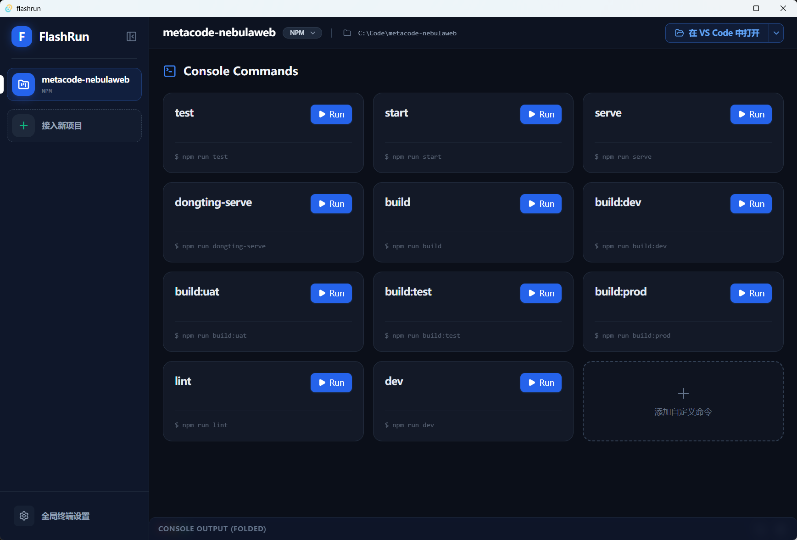

# ⚡ FlashRun 

<div align="center">
  
  
  <p><strong>一款为现代前端开发者设计的、极具赛博极客美学的多项目终端/启动器面板。</strong></p>

  [](https://tauri.app/)
  [](https://reactjs.org/)
  [](https://www.rust-lang.org/)
  [](https://tailwindcss.com/)
  <br />
</div>
<div align="center">
  <br/>
  <h2>🚀 立即体验 FlashRun</h2>
  <a href="https://github.com/Jveen-D/flashrun/releases/latest">
    
  </a>
  <p><b>✨ 原生支持：🍏 macOS (Apple Silicon / Intel) &nbsp;|&nbsp; 🪟 Windows 10/11 ✨</b></p>
  <br/>
</div>

## 📦 安装指南与下载 (免编译)

如果您不想折腾代码，只需点击上方按钮，或者前往本仓库的 [**Releases 最新发行版页面**](https://github.com/Jveen-D/flashrun/releases/latest) 下载构建好的原生安装包。
得益于 GitHub Actions 全自动云端编译，我们免费为您硬核提供：
- 🍎 **macOS**: 支持 Intel 和 Apple Silicon M 系列芯片 (`.dmg` 镜像文件)
- 🏁 **Windows**: 支持标准系统级安装与绿色便携版 (`.msi` 微软标准安装包 / `.exe`)

> ⚠️ **macOS 用户安装须知 (必看)**：
> 由于本应用为免费且硬核的开源构建版，我们尚未缴纳 Apple 开发者高昂的年费并进行数字证书签名（Notarization）。当您首次在 Mac 上点开下载好的 `.app` 时，苹果的 Gatekeeper（门禁拦截系统）可能会故意误报恐吓：**`"FlashRun.app"已损坏，无法打开。您应该将它移到废纸篓。`**
> 
> **终极解决方法**：打开您的 Mac 自带的 `终端 (Terminal)`，直接敲入下面这行“放行命令”强行解除系统误判的隔离标签即可（假设您已将 App 拖入了「应用程序」文件夹）：
> ```bash
> sudo xattr -rd com.apple.quarantine /Applications/FlashRun.app
> ```

---

## 📖 什么是 FlashRun？

如果你每天需要同时维护 3~5 个前端项目，受够了频繁地 `cd` 切目录、每次开机就要重敲 `pnpm dev` 并且终端窗口堆积如山……那么 **FlashRun** 就是你的终极解药。

**FlashRun** 是一个纯原生的桌面级控制台面板（基于 Tauri 构建）。它会自动读取你提供的项目路径，嗅探 `package.json` 中的命令脚本，并将枯燥的 CLI 转化为极简炫酷的操作磁贴。你可以一键丝滑启停任何服务对象，并借助内置的高性能终端引擎（Xterm.js）实时沉浸地追踪所有构建日志。

## ✨ 核心特性 

- 🚀 **一键启动/终结**：自动解析 `[npm/pnpm/yarn/bun] run xxx` 流程，通过图形化磁贴直接运行与停止子进程。
- 🔮 **独立日志流终端**：自带沉浸式彩色终端 (`Xterm.js`) 展示后端标准流输出，更支持 `Ctrl+左键` 点击终端内的 URL 链接直接拉起浏览器！
- 🗂 **多开极速侧边栏**：左侧 260px 加宽管理面板，清晰收录并排列你所有的工作区项目与包管理器属性。
- 🎮 **丝滑电竞级动效**：高度纯净剔透的深色（暗紫金属） UI 审美，所有下拉框、磁贴与侧面板都实现了完全的物理引擎级缓动动画 (`Headless UI`)。
- 💻 **全智能联动**：不仅是启动器，也能当资源管理器用。一键在 `VS Code / Cursor / 等默认编辑器` 甚至操作系统的默认文件夹中拉起当前项目代码。
- 📦 **零内存负担**：得益于 Rust + Tauri 的架构魔法，即使这是一款如此复杂的 GUI 工具，它在系统后台所占据的体积和内存也几乎可以忽略不计。

## 📸 界面预览



## 🛠️ 想要参与开发？

如果你想在此基础上修改一套专属界面或新增私有功能，只需按如下步骤在本地跑起来：

### 环境前置要求：
1. [Node.js](https://nodejs.org/) (当前测试通过 Node 20+)
2. [Rust](https://www.rust-lang.org/tools/install) 原生编译工具链
3. （部分操作系统需补充安装 [Tauri 指定库](https://tauri.app/zh-cn/v1/guides/getting-started/prerequisites)）

### 克隆并启动：
```bash
# 1. 克隆代码
git clone https://github.com/Jveen-D/flashrun.git

# 2. 进入目录并安装前端依赖
cd flashrun
pnpm install

# 3. 唤醒本地开发服务器 (Rust 编译器将会接管构建并自动打开独立 APP 窗口)
pnpm tauri dev
```

### 本地打包产物：
```bash
# 生成本地专属的 .exe (Windows) 或 .dmg (Mac)
pnpm tauri build
```

## 💖 许可协议与鸣谢

本仓库发布遵循 **MIT 协议**。完全开源，欢迎各类代码合并/衍生。
感谢 `Tauri` 引擎和 `Lucide` 图标集使得开发这套原生系统得以如此优雅。
